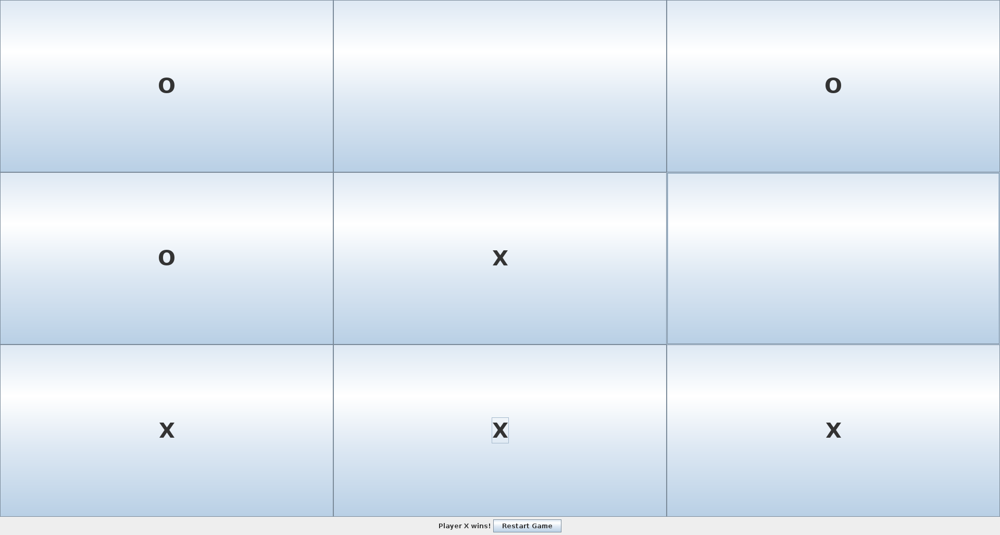

# Tic Tac Toe

## Description
Tic Tac Toe is a simple two-player game implemented in Scala 3. Players take turns marking a square in a 3x3 grid, and the first to align three marks in a row (horizontally, vertically, or diagonally) wins the game

